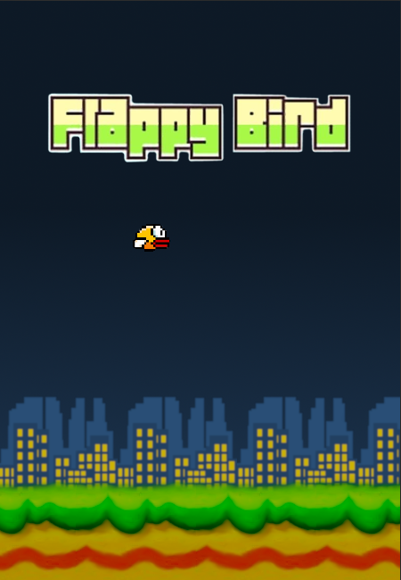

# FlappyVala

un petit flappy bird en vala avec ma lib Burger

# Installation

`meson build --prefix=/usr`

`ninja -C build`

`ninja install -C build` // en root

# Dependencies

ninja
meson
sdl2
sdl2_gfx
valac

